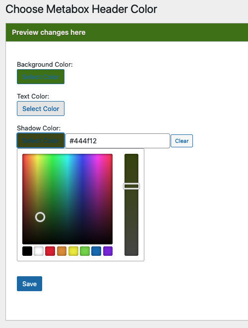

# Metabox Header Color

Contributors: trepmal  
Donate link: http://kaileylampert.com/donate/  
Requires at least: 3.5  
Tested up to: 5.7  

This plugin isn't very useful in modern WordPress, as most metaboxes are being replaced with the Block Editor experience.

Change the color for the metabox headers for easy visibility.

## Installation

1. Upload the contents of the zip file to the your plugins directory (default: `/wp-content/plugins/`)
2. Activate the plugin through the 'Plugins' menu in WordPress
3. Go to the Metabox Header Color page under Settings
4. Enter the color hex code you'd like to use and save

## Screenshots

## Changelog

### 1.6
* basic upkeep

### 1.5
* minor css tweak. due to low number of downloads, this may be the plugin's last update

### 1.4
* remembered why I hadn't added '!important' to css before - it messes things up. this version uses better css selectors

### 1.3
* added '!important' to css to ensure that that the styles will apply on all screens

### 1.2
* Better after-save preview

### 1.1
* jQuery upgrades

### 1.0
* Initial Release